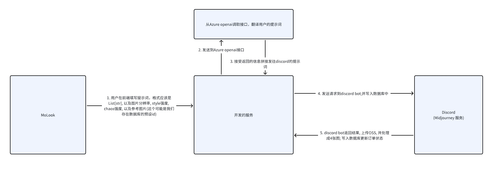

# 产品需求文档

业务需求: 衣服等纹理生成
创建纹理, 衣服上的图样, 纹理

**图案, 面料生成DEMO**

业务需求: 衣服等纹理生成
创建纹理, 衣服上的图样, 纹理

不同类型的风格 也会封装一下, 比如用户输入了一个老虎,
翻译的话 那只是 a tiger 但是我们给midjourney的提示词肯定是加了其他的风格
比如涂鸦 简笔画 赛博朋克 这种
这里应该有一个表来做对应
包含 midjourney 提示词参数 前后 append的内容 gpt翻译的提示词
还有风格的参考图片

图像生成最大并发量3

## 整体架构

同时我们要考虑一下扩展性，比如comfyui其实是处理了很多类型的任务
midjourney这个可能也会处理很多任务

生成 单次生词

很多风格
涂鸦,

无缝材质

交互逻辑 /imagine prompt

bot 转发到

不需要按钮

一张图 拆才成4张图

放大

按钮先不管

通过subtask

只需要生成图就可以了

生成时间:

relaxed usage 慢 无限制

# TODO  指令加入数据库, 20 个指令 随机选一个

    # 存储
    # 情形一: 用户不指定风格. 用户指定

    # 情形二: 指定风格就拼接

    # 客户 输入老虎,    生成风格,

